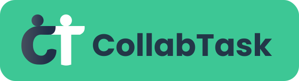

# CollabTask

En este proyecto se ha desarrollado una app sobre la gestión de tareas colaborativas para el Trabajo de Fin de Grado de Ingeniería Multmiedia en la Universidad de Alicante.

## Objetivo 

El principal objetivo de esta aplicación es permitir a los usuarios crear grupos entre otros usuarios para poder gestionar y obtener un reparto de tareas equilibrado y justo, enfocado en un contexto colaborativo y amigable, en el cuál se fomenta la participación y se cuenta con un sistema que recompensa a las personas que cumplen con sus tareas.

## Funcionalidades principales

- Formar un equipo de personas y elaborar listas de tareas junto con los demás participantes
- Existen dos tipos de reparto distintos:
  - Reparto manual: Reparto en el que los usuarios deben asignarse las tareas una por una ellos mismos.
  - Reparto automático por preferencias: Los usuarios podrán establecer qué tareas del reparto preferien realizar y un algoritmo repartirá las tareas teniendo en cuenta las preferencias de los usuarios y los puntos que hayan obtenido a lo largo del tiempo usando la aplicación.
- Intercambio de tareas. Los usuarios pueden intercambiarse las tareas entre los compañeros utilizando sus puntos o intercambiando sus tareas por otras.
- Los usuarios pueden valorar el trabajo de sus compañeros para que estas valoraciones se vean reflejadas en su perfil.
- Tanto las valoraciones como la eficacia con las tareas asignadas mejoran el sello de calidad de CollabTask. Un sello que refleja el buen trabajo de los usuarios.

## Funcionalidades a destacar

Collabtask cuenta con varias funcionalidades a destacar, como són:

- **Interacción entre varios usuarios a tiempo real**: El movimiento de las tareas entre usuarios se produce a tiempo real sin tener que recargar las interfaces. Esto se ha conseguido utilizando observables para la comunicación entre la app y la base de datos de Cloud Firestore, haciendo de esta forma que todos los participantes de un mismo equipo puedan interactuar a la vez mientras se hace el reparto.

- **Sistema de notificaciones diarias**: Cada día se ejecuta una función que manda a una notificación a todos los usuarios que tengan tareas pendientes para que no se les olvide realizarlas.

- **Algoritmo de reparto**: Se ha implementado un algoritmo que reparte las tareas entre todos los participantes de un equipo teniendo en cuenta sus preferencias y los puntos que han ido consiguiendo con el tiempo. Este algoritmo reparte las tareas de una forma equitativa y justa.

- **Sello de calidad**: El sello de calidad es un porcentaje que se calcula teniendo en cuenta la eficacia que el usuario ha obtenido completando sus tareas y las valoraciones que ha recibido de sus compañeros. Este porcentaje es público y demuestra tanto el trabajo empleado como la opinión de tus compañeros hacia ti.
